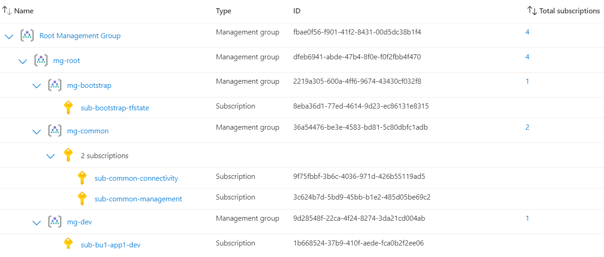

# terraform-azure-foundation

This is dedicated to the creators of [terraform-example-foundation](https://github.com/terraform-google-modules/terraform-example-foundation)

Stages 0-4 are run manually using a service principal with owner role at root management group. 

Stage 5 is run on github with OpenID authentication using uai infra-cicd (which was created as part of stage 2). Federating an uai is also part of stage 2.

Stage 6 is run on github with OpenID authentication using uai app-cicd (which was created as part of stage 2). Federating an uai is also part of stage 2.

The actual app in stage 6 is run using uai app (which was created as part of stage 2) and can pull images from acr.

Status of each stage:

0. bootstrap - partially complete - deployed

1. org - partially complete - deployed

2. subscriptions - partially complete - deployed

3. networks - partially complete - not deployed

4. security - not started

5. aca-infra - partially complete - not deployed

6. aca-app - partially complete - not deployed

## Org hierarchy

